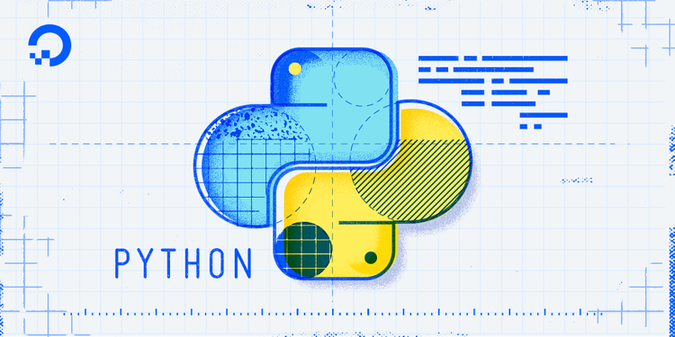
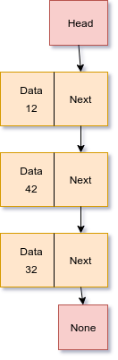
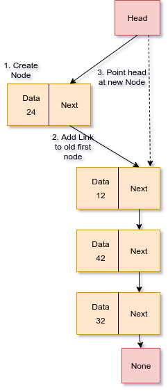
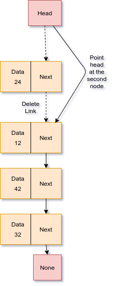
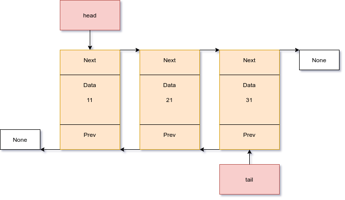
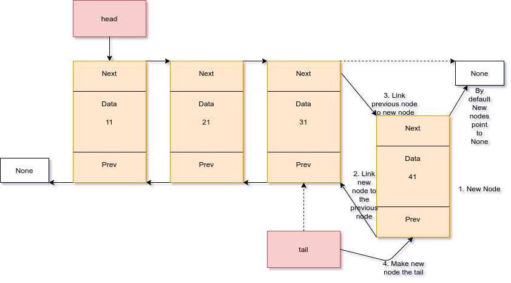
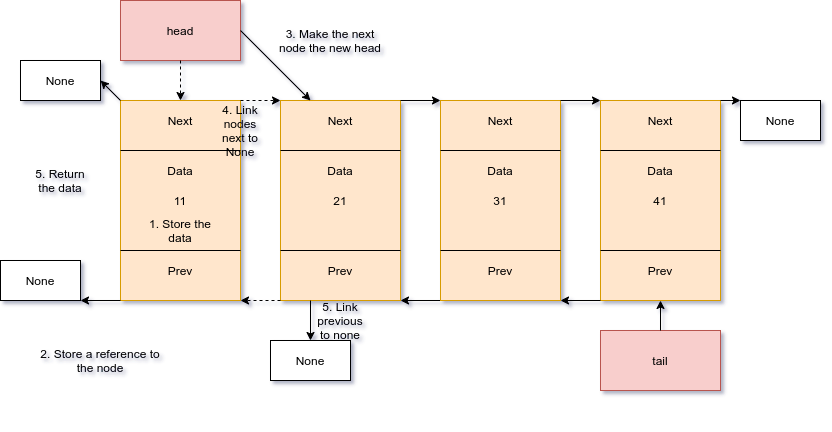

# Linked Lists

## TOC

* [Welcome](index.md)
* [Stacks](1-topic.md)
* [Linked lists](2-topic.md)
   * [Introduction](#Introduction-to-Linked-Lists)
   * [Singly Linked Lists](#Singly-Linked-Lists) *as a stack*
      * [Push](###push)
      * [Pop](###pop)
   * [Doubly Linked Lists](#Doubly-Linked-Lists) *as a queue*
      * [Enqueue](###Enqueue)
      * [Dequeue](###Dequeue)
   * [Coding Challenge](#Coding-challenge)
* [Binary Trees](3-topic.md)

---
# Introduction to Linked Lists

Instead of using arrays which are contiguous blocks of memory we
can implement various data structures with linked lists. We could use
a linked list to implement the stack data
structure we saw in the last module. Instead of contiguous blocks of memory, we'd use discrete nodes that point at the next node which then points at the next node ad infinitum. This has an advantage
over arrays in that we don't run the risk of running out of
contiguous memory and end up having to copy the entire array to a new
area with enough free contiguous memory to hold it. All typical stack
operations would have the same big O notation performance as well.

A disadvantage is we can't directly access any point in the
linked list like we can with an indexed array, we'd always have
to start at the front and work our way through the list
to get to the desired node. So if you need to access middle nodes often a linked list would be a poor choice of implementation.

# Singly Linked List

A singly linked list would work to represent the stack we saw in the previous module. Consider the linked list pictured below.



This stack, represented by a linked list has 3 nodes, or values, 32,42,12. 12 is at the top of the stack, 32 at the bottom.

This is a sample class that might represent a
singly linked list. *Note*: It's currently missing the **push** and **pop**
operations a stack requires. We'll add them soon.

```python
class Stack:
    '''
    This represents a stack implemented by a singly
    linked list.
    '''

    class Node:
        '''
        An individual node inside a linked list
        '''

        def __init__(self, data):
            '''Initialize with provided data and no links.'''
            self.data = data
            self.next = None

    def __init__(self):
        '''Initialize an empty linked list.'''
        self.head = None

    def push(self, value):
        '''Add a node to the top of the stack.'''
        pass

    def pop(self):
        '''Remove a node from the top of the stack.'''
        pass

```

### Push

In a linked list that top node is a special node we typically call
the **head** node. To add a new node to the top of the stack in a
**push** operation we'd:

1. Create a new node.
2. We'd set this new nodes next to point at whatever the **head** points at.
3. Point **head** at this new node.

For
 example suppose we **push** a new node containing the value 24 onto
 the stack pictured above. This is a O(2) operation. Below is what
 a **push** operation would visually look like.

  ***Important***: Remember to always point your new node at the old top node before you point head at the new node, otherwise you will lose your link to the old top node.


 The only caveat to be aware of is when your pushing to an empty list,
 you'll want to just point head at your new node and leave it's next pointed
 at None.



This is what that would look like in Python:

```python
def push(self, value):
   '''Adds a node to the top of the stack.'''

   new_node = Stack.Node(value) # Create a new node

   # This is that check for an empty list.
   if self.head is None:
      self.head = new_node
   else:
      new_node.next = self.head # This connects the new node to the old
      self.head = new_node # This sets the new node as the new head
```

### Pop

A **pop** operation is fairly straight forward.

1. You will want to grab the data
you are interested in from the first node.
2. You'd point head at the next node on the list.
3. Point your old top node at None.

Python's garbage collector will delete the node for you. A pop
operation is pictured below.

The only caveat to be aware of is you need to be aware of doing a **pop** operation
on an empty linked list. Instead refuse to pop and print an error message.



Here is what that would look like in Python.

```python
def pop(self):
   '''Removes a node from the top of a stack, and returns it's data'''

   if self.head is None:
      print("Can't pop an empty list")
      return
   else:
      node = self.head # Temporarily store the node so we don't lose it when head is reassigned
      data = node.data # Get the data from the node
      self.head = node.next # Set head to the next item down
      node.next = None # Set the node.next being popped to None, python will garbage collect it.
      return data
```

The only thing that's missing are some helper functions to help python navigate
this data structure we have created. One is **\_\_iter\_\_** which tells python how
to loop through our stack. The second is **\_\_str\_\_** which tells python how
to represent our data structure as a string. These are given below.

```python
def __iter__(self):
   curr = self.head
   while curr is not None:
      yield curr.data
      curr = curr.next

def __str__(self):
   output = "stack["
   first = True
   for value in self:
      if first:
         first = False
      else:
         output += ", "
      output += str(value)
   output += "]"
   return output
```

For a completed file containing this class see [ll-single.py](src/ll-single.py)

I would suggest for practice attempt to solve the [previous modules](1-topic.md#Coding-Challenge) challenge with
this new implemenation of a stack.

*Additional thinking*: If you needed to remove a node from the middle of the linked list how would you do that? It's helpful to draw it out on a whiteboard.

# Doubly Linked Lists

If you recall in the [previous module](1-topic.md#Anti-Example) we talked how about a line at a grocery store
would perform terribly with the stack data structure. The data structure that solves this problem is called a queue, it can be implemented with a doubly linked list. A queue will add data to the end of the list, and remove data from the front. Both operations are O(1) when implemented with a doubly linked list. Queue's are very useful anytime we want to process data in the order
that it arrived.

Doubly linked lists are just like singly linked lists only
they have an additional special node called the tail. It's at the end of the list. Also every node in addition to pointing at the next node, points at it's previous node. This means we can travel the linked list forwards and backwards. As a bonus because we aren't relying on contiguous memory, if we remove an item from the front
we don't have to shuffle everything forward like we would
need to with an array.


A doubly linked list might look as pictured below.



To get a doubly linked list working for a queue, we'll need at least two operations.

An **enqueue** operation will allow us to put something into the queue, and **dequeue** would allow us to take something out of the queue to process it.
These will actually be very similar to our **push** and **pop** operations
already written for stacks.
Below is a skeleton of our queue class in python:

*notice how similar it is to a singly linked list?*

```python
class Queue:
    '''
    This represents a queue implemented by a doubly
    linked list.
    '''

    class Node:
        '''
        An individual node inside a linked list
        '''

        def __init__(self, data):
            '''Initialize with provided data and no links.'''
            self.data = data
            self.previous = None
            self.next = None

    def __init__(self):
        '''Initialize an empty linked list.'''
        self.head = None
        self.tail = None

    def enqueue(self, value):
        '''Add a node to the end of the queue'''
        pass

    def dequeue(self):
        '''Remove a node from the front of the queue.'''
        pass
```

### Enqueue

To **enqueue** an item, we will add it to the tail. To do this we:

1. Create a new node.
2. Link the new nodes previous property to the tail.
3. Link the tails next property to our node.
4. Make the new node the tail.

This enqueue operation is pictured below:



Using this, and you can use the singly linked lists **push** operation we've already
programmed as a base, create your *own* **enqueue** operation. Please keep in mind some key differences. We are working at the **tail** not the **head** for the **enqueue** operation. Just like in the **push** operation, we need a special check for an empty linked list and we have one extra link to deal with, the previous link.

Check your solution against this completed solution: [dl-enqueue.py](src/dl-enqueue.py)

### Dequeue

Next we need a dequeue operation. The dequeue operation will get the data from the first item in the linked list, and delete that first node. To do this operation we need to:

1. Get the data from the first node.
2. Store a temporary reference to the node.
2. Make the next node the new head.
3. Link the nodes next property to None.
4. Link the new heads previous property to None.
5. Return the data.

Below is a visual of this operation:



Using this, and again you can use the singly linked **pop** operation we've
already programmed as a base, create your *own* **dequeue** operation. Please
keep in mind that just like with the **pop** operation, you need to be aware of
**dequeueing** an empty list. The only real difference is the extra link.

Check your solution against this completed solution: [dl-dequeue.py](src/dl-dequeue.py)


# Coding Challenge

The coding challenge will be to implement a queue using a doubly linked list.
The queue will be used to process athletes scores and output their rankings.

The athletes information will come in tuples (name, place, score). A process
method is already written which takes the tuple passed to it and outputs what
medal the athlete gets.

Luckily if you've already written the **enqueue** and **dequeue** operations,
you've already done the work for this challenge. All you need to do is plug
them into this starter code: [2-topic-starter.py](src/2-topic-starter.py).


Check your solution against this completed version: [2-topic-solved.py](src/2-topic-solved.py).


[Back to top](#Linked-Lists)

[Previous Module](1-topic.md)

[Next Module](3-topic.md)
