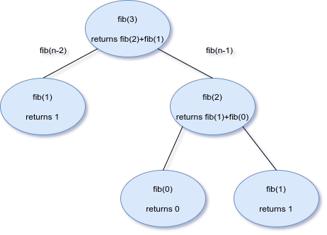
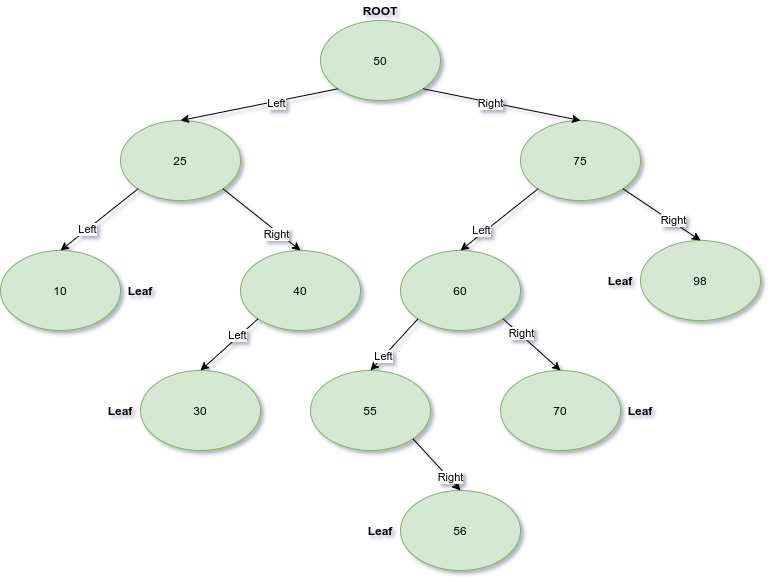
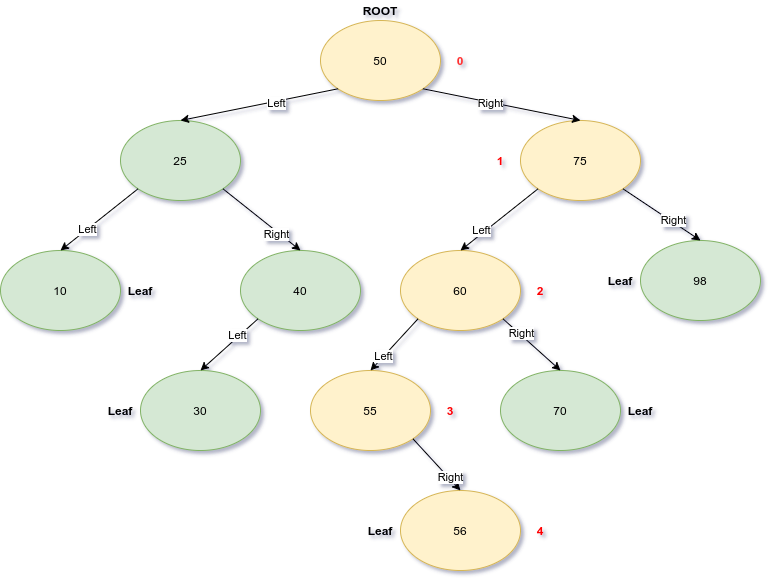
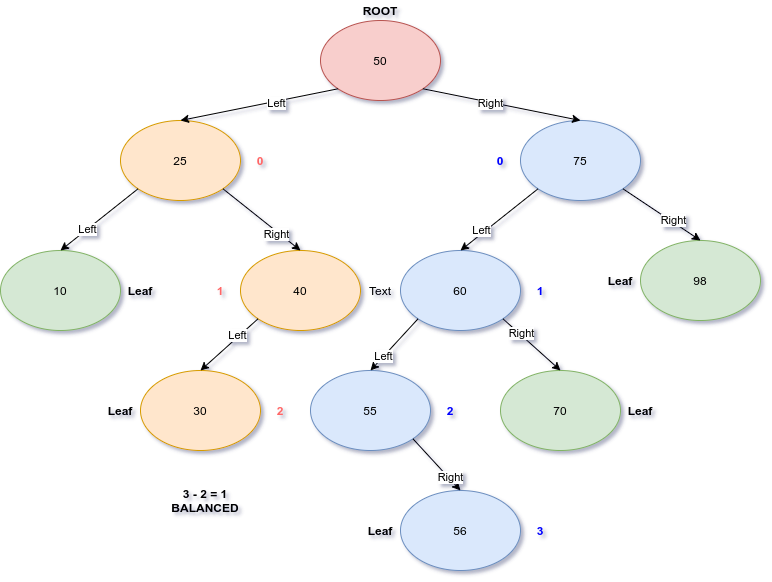
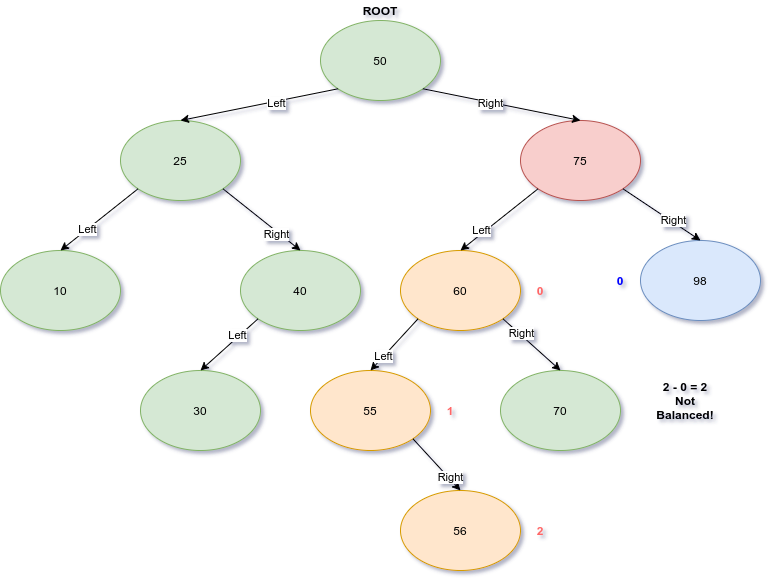

# Binary Trees

## TOC

* [Basic Data Structures](welcome.md)
* [Stacks](1-topic.md)
* [Linked lists](2-topic.md)
* [Binary Trees](3-topic.md)
  * [Introduction](#introduction-to-binary-search-tree's)
  * [Recursion](#recursion)
  * [Basics](#bst---basics)
  * [Coding Challenge](#coding-challenge)
  * [Helper Functions](#helper-functions)
    * [Iteration](#iteration)
    * [Tree Height](#getting-a-tree's-height)
    * [Inserting](#inserting-into-a-bst)
    * [Searching](#searching-a-bst)
  * [Combine it](#combine-it-all)


---

# Introduction to Binary Search Tree's

An issue with every data structure so far is the time it takes to
find any given item. With **stacks** and **queues** whether we
implement them with **arrays** or **linked lists** it takes *O(n)*
time to find any given node in the data structure.

Luckily there is a data structure that it is great at sorting and
finding data. It's a **Binary Search Tree** or **BST** for short.
**BST**'s are extremely efficient at searching for nodes.

# Recursion

But before we talk in depth about **BST**'s we must discussion **recursion**.
**Recursive** algorithm's are often used with **BST**'s. Recall back
in the very first [Introduction](welcome.md#big-o-notation) module
when talking about Big O notation a recursive function that
calculated the fibonacci sequence was introduced. Here is that function again:

```python
 def fib(n):
   # base case
   if n <= 1 : return n
   # recurse to solve the rest
   return fib(n - 2) + fib(n - 1)
```

This function has two lines, the base case, and the recursive
algorithm.

When creating a recursive algorithm you want to consider when is
your problem solved, with a fibonacci sequence it is solved when
we've counted down all the way to 1.

You also want to think about how you can solve one simple piece
of the problem, and hand off the rest of the problem to a function,
knowing and trusting that the function can solve the rest.

In this case we call *fib* again with **n - 2** as a parameter, and add it's result to a second call to *fib* with **n - 1** as a
parameter.

Think on what happens if you called ***fib(3)***

1. fib(3) would check if n <= 1, it's not so it proceeds to the next line.
2. fib(3) would then call fib(1) and fib(2) and add their results together.
3. fib(1) would check if n <= 1, it is so it returns n, which is 1.
4. fib(2) would check if n <= 1, it's not so it proceeds to the next line.
5. fib(2) would call fib(0) and fib(1) and add their results.
6. fib(0) would check if n <= 1, it is so it would return 0.
7. fib(1) would check if n <= 1, it is so it would return 1.
8. fib(2) now has the results of fib(0) and fib(1), 0 and 1 respectively. It will add those and return the result which is 1.
9. fib(3) now has the results of fib(1) and fib(2), which is 1, and 1 respectively. It will add them together and return the result which is two.
10. The solution to fib(3) is two.

Here is a simple tree which depicts this sequence of events.



Thinking recursively isn't easy, but you need it for some algorithms.
**BST**'s are one of those cases.

# BST - basics

A **BST** is somewhat similar to a **linked list** in that you have
discreet nodes which point to other nodes. Like a **singly linked list** node links only go one way, not both ways like in a **doubly linked list**.

At the top of your tree you have the **root** node. It will have links
to two nodes, a left node and a right node. Each node below the root
is the same. Nodes that have no child links are called leaves. This is perhaps best shown with a picture.



The pictured **BST** has the node with a value of
50 set as the **root** of the tree. To the left of the root node
are all values smaller than itself, to the right are all values
larger. No duplicates are allowed.

Each node of this **BST** can be viewed as a subtree with itself as the **root**.
For example if we got to the left of the root node, and view the
node with a value of 25 as the root or our subtree you can see it has
all of the same properties discussed for the original root.

This property is how we deal with a **bst** using recursion, each
pass we view the next node as it's own subtree.

A given **BST**'s height is found by counting the number of hops it
takes to get from the root to the furthest leave. We start at zero so
a tree with a root and no child links as a height of 0. The height of
the example tree above is depicted below showing it has a height of 4.



For **BST**'s to be efficient when searching we need to keep them
balanced. To determine if a tree is balanced we check the height of
both sides and ensure that neither side has a height difference more than 1. This must also hold true for each subtree. So is our example
**BST** balanced? Let's take a look visually. To do this we will find
the height of the left and right subtrees, and check that they aren't
more than 1 different.



As depicted these two subtrees are balanced but we have to keep checking to see if the rest are balanced as well. We will descend
down the right side and check the left and right subtrees under node
75.



Oops! This subtree is not balanced on the left and right sides. This
will hurt the efficiency of searching this **BST**. This means the
overall tree is not balanced. There are efficient ways to balance
tree's, which involves rotating nodes to shift the roots of subtrees
but we won't discuss this in depth here. For fun though here is a
gif that shows what balancing a tree looks like.


# Coding Challenge

For this modules challenge, like with the
linked lists. We will build up a **BST** class
with each individual module and then apply it
to a problem.

You will be given a sorted list of States that have been decimated
by a zombie apocalypse. Your task will be to build a balanced tree
from this list so that users can query which states they should not
be visiting.

# BST Skeleton

We'll start off with a skeleton of a **BST** class.

```python
class BST:
  '''A Binary Search Tree.'''

  class Node:
    '''An individual node within a BST.'''

    def __init__(self, data):
      '''Initialize a node with no known links.'''

      self.data = data
      self.left = None
      self.right = None

  def __init__(self):
    '''Initialize an empty BST.'''

    self.root = None
```

# Helper functions

We could really
use some functions that help us debug
and round out the features of our BST more. We are going to create
two dunder functions to teach python how to iterate over this
data structure forwards and backwards. We are also going to create a
function that reports on the height of the BST. These will give you
an idea of how we will use recursion to work with **BST**s and the
general pattern for how we'll be writing functions.

## Iteration

When we do an in order traversal of a **BST** we want to print all
nodes in order of least to greatest. Considering that lesser nodes
are on the left, and greater nodes are on the right the way we might
traverse a **BST** is:

1. Descend down the left side.
2. When we hit a leaf yield the data.
3. Descend down the right side.
4. When we hit a leaf yield the data.

We are going to use the \_\_iter\_\_ dunder function to call a
recursive _traverse_forward.

\_\_iter\_\_ will just call the recursive algorithm like this:

```python
def __iter__(self):
  '''Teach python how to iterate over our data structure'''

  yield from self._traverse_forward(self.root) # start at the root
```

The actual _traverse_forward will follow the pattern outlined above:

```python
def _traverse_forward(self, node):
  '''
  If a node is none do nothing, otherwise travel down
  the left side then the right side
  '''

  if node is not None:
    # travel down the left, this will stop when it heads a node
    # with no left node
    yield from self._traverse_forward(node.left)
    yield node.data
    # Do the same on the right
    yield from self._traverse_forward(node.right)
```

What this does is call itself going down the left side until it lands
on a node that is None, once it hits none it pops up one node and returns that nodes data (this would be the left most leaf). Then it attempts to do the same down the right side.

To iterate backwards we need to write a \_\_reversed\_\_ function.
It is exactly the same only we traverse down the right side, then the left. I'll let you write \_\_reversed\_\_ yourself.

## Getting a tree's height.

The next function we'll need is one that reports the **BST**'s
height. Again we'll use a function to call anther recursive
function (that's a pattern that will hold).

What we'll do is add up the height of all subtrees recursively
and return the height of the tallest one.

```python
def get_height(self):
  '''Determine the height of a BST.'''

  # If it's an empty tree our height is zero
  if self.root is None:
    return 0
  else:
    return self._get_height(self.root)
```

This is the recursive part.

```python
def _get_height(self, node):
  '''
  The height of any subtree is 1 plus the height of either the left
  or right subtree, whichever is greater.
  '''

  # This is the base case, we are at a Node that is None
  if node is None:
    return 0
  else:
    # A lot like __iter__, we just go down one side at a time.
    # Adding up their heights
    sum_right = 1 + self._get_height(node.right)
    sum_left = 1 + self._get_height(node.left)
    # We return whichever sum is greatest.
    return sum_right if sum_right > sum_left else sum_left
```

# Inserting into a BST

With those helper functions in hand to help us debug the next thing
we need to be able to do is insert values into a
**BST**. By the way, if our tree is balanced, the worst case
performance is O(log₂n).

The steps.

1. Create a node
1. Check for an empty tree
2. If it's empty, just make the node the root.
3. If it's not, call a recursive insert function.

The recursive insert
1. Check that the node isn't equal to the value we are inserting
2. If they are equal abort, we can't have duplicates
3. If it's value is less than this node, it goes on the left. Check if we have a child node to the left. If not insert it, otherwise call insert again on the left node.
4. If it's value is greater than this node, it goes on the right. Check if we have a child node to the right. If not insert it, otherwise call insert again on the right node.

Write an insert function that does the first group of steps.

Write a recursive _insert function that does the last group of steps.

Check your solution against [bst-insert.py](src/bst-insert.py)

# Searching a BST

The next step needed for this coding challenge is the ability to
search for values. Like inserting, searching a balanced **BST**
has a performance of O(log₂n). To search our **BST** we will write a
dunder method \_\_in\_\_. This let's use use the python keyword ***in*** to check if a value is in the **BST**.

The actual code in the \_\_in\_\_ function will just call a recursive
function called _contains and return it's result.

_contains will take the data it's looking for and the node it's to
operate on.

The steps _contains should be taking.

1. Check for an empty node. If it is empty return False.
2. Check if the node has our data. If it does return True.
3. Check if data is less than or greater than our current node.
4. Recurse down the left or right side respectively based on the check above.

Write the \_\_in\_\_ function.

Write the _contains function.

Check your solution against [bst_search.py](src/bst_search.py)

# Combine it all

With these in hand we have a basic **BST** that will
solve the problem efficiently. Because the data you are being given
is a sorted array, you'll want the root of your **BST** to be the
middle value of the array.

You will write a recursive function that inserts data from the
middle of the array. Remember each subtree needs to also have it's
root as the middle of a sub-array. This function will be called from
a create_bst() function.

Here is some starter code, it has an interactive portion commented
out. Once you've done enough debugging that you feel like it's solved.
You can uncomment the interactive portion and test it out.

[bst-start-code.py](src/bst-start-code.py)

Check your solution against [bst-completed.py](src/bst-completed.py)

[Back to top](#basic-data-structures-an-introduction)

[Previous Module](2-topic.md)
